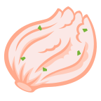

# Kimchi

**K** - Kotlin
**i** - Inject
**m** - Merge
**c** - Component
**h** - Hints
**i** - Intuitively

Kimchi is an [Anvil]()-like KSP processor for [kotlin-inject]() that lets you contribute bindings, modules, and subcomponents across multi-module projects to form your dependency injection graph without manual wiring.

## Getting started

🚧 _THIS LIBRARY IS A WIP_ 🚧

## License

```
Copyright 2024 r0adkll

Licensed under the Apache License, Version 2.0 (the "License");
you may not use this file except in compliance with the License.
You may obtain a copy of the License at

   https://www.apache.org/licenses/LICENSE-2.0

Unless required by applicable law or agreed to in writing, software
distributed under the License is distributed on an "AS IS" BASIS,
WITHOUT WARRANTIES OR CONDITIONS OF ANY KIND, either express or implied.
See the License for the specific language governing permissions and
limitations under the License.
```

