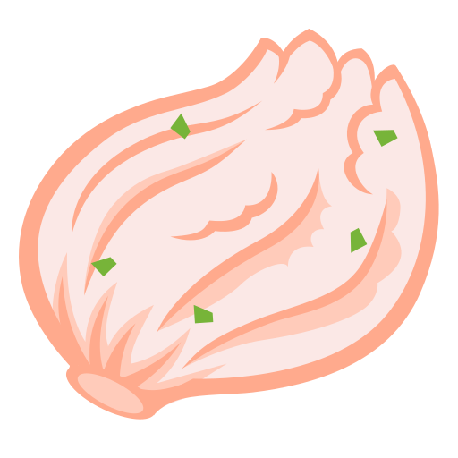

 Kimchi
======

**K**_otlin_ **I**_nject_ **M**_erge_ **C**_omponent_ **H**_ints_ **I**_ntuitively_

Kimchi is an [Anvil](https://github.com/square/anvil)-like KSP processor for [kotlin-inject](https://github.com/evant/kotlin-inject) that lets you contribute bindings, modules, and subcomponents across multi-module projects to form your dependency injection graph without having to manually wire them upstream.

## Overview

Kimchi is all about being able to connect your [kotlin-inject](https://github.com/evant/kotlin-inject) enabled DI elements across the entirety of your codebase without having to explicitly wire them yourselves in a common upstream location.

To give a simple high-level overview of how to achieve this with Kimchi are these three steps:

1. Define a `Scope` marker class to indicate where and what you want to merge
2. Create a `@MergeComponent` annotated component scoped with your marker to merge your elements
3. Contribute dependencies to this `Scope` marker

## Example

Give give a more concrete example of these steps lets take this simple example

### Define a scope marker

```kotlin
object AppScope
```

### Define a component

```kotlin
@MergeComponent(AppScope::class)
interface AppComponent
```

### Contribute a dependency

```kotlin
interface AppInitializer

@ContributesBinding(AppScope::class)
@Inject
class RealAppInitializer(/*…*/) : AppInitializer
```

### Bringing it all together

The above is all your really need to get started! The above will result in a merged generated component that looks something like:

```kotlin
@Component
abstract class MergedAppComponent : AppComponent {

  val RealAppInitializer.bind: AppInitializer
    @Provides get() = this
}

// This calls the underlying kotlin-inject generated component to create itself
fun AppComponent.Companion.createAppComponent(): MergedAppComponent = //…
```

Then in your application code, all you have to do is create your new component!
```kotlin
class MyApplication : Application() {
  override fun onCreate() {
    super.onCreate()

    val component = AppComponent.createAppComponent()
    //…
  }
}
```
### Dive into more
This is of course just the most basic example of how to use Kimchi and only scratches the surface with what you can do and how you can build your dependency injection graph across your project. Get started with a more detailed guide and examples [here]()!

## License

```
Copyright 2024 r0adkll

Licensed under the Apache License, Version 2.0 (the "License");
you may not use this file except in compliance with the License.
You may obtain a copy of the License at

   https://www.apache.org/licenses/LICENSE-2.0

Unless required by applicable law or agreed to in writing, software
distributed under the License is distributed on an "AS IS" BASIS,
WITHOUT WARRANTIES OR CONDITIONS OF ANY KIND, either express or implied.
See the License for the specific language governing permissions and
limitations under the License.
```
